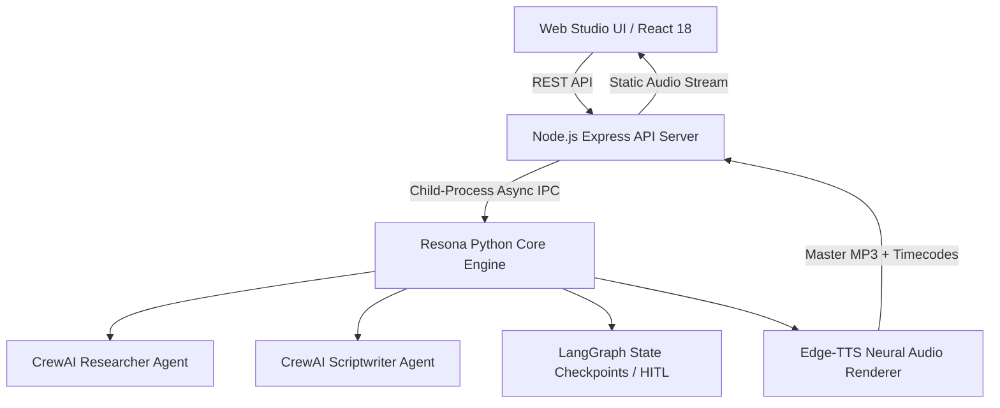

# Resona AI - Autonomous Multi-Agent Podcast & Audio Studio

[](https://python.org)
[](https://nodejs.org)
[](https://react.dev)
[](https://crewai.com)
[](https://langchain.com)

**Resona AI** is an enterprise-grade, autonomous **Multi-Agent Audio & Content Intelligence Platform**. It transforms raw topics, URLs, technical papers, or markdown notes into a studio-quality two-host audio podcast with dual-voice neural speech synthesis, interactive Human-in-the-Loop script editing, and synched transcript playback.

---

## ✨ Features

- **CrewAI Multi-Agent Team (`engine/crew_agents.py`)**:
  - **Senior Tech Researcher**: Scrapes URLs, parses abstracts, and extracts core insights.
  - **Podcast Scriptwriter**: Structure natural 2-host dialogue between **Alex** (*Inquisitive Host*) and **Sam** (*Domain Expert*) with natural conversational cues.
  - **Audio Director & Quality Critic**: Reviews line lengths, turn counts, and audio pacing.
- **LangGraph Human-in-the-Loop (HITL) Workflow (`engine/graph_workflow.py`)**:
  - Pauses execution after script generation, allowing users to edit dialogue turns, change speakers, or add lines in the UI before audio rendering.
- **Dual-Voice Neural Speech Synthesizer (`engine/audio_renderer.py`)**:
  - Maps speakers to distinct neural voices (`en-US-GuyNeural` & `en-US-JennyNeural`) using `edge-tts` with offline `pyttsx3` fallback.
  - Stitches individual dialogue turns into a master `.mp3` podcast file with audio timecode metadata.
- **Claude-Inspired Web Studio UI**:
  - **Studio Hub**: Multi-source input manager with target podcast length selectors (2-min digest vs. 10-min deep dive).
  - **Interactive Script Editor**: Live dialogue editing and audio re-rendering.
  - **Synched Audio Player**: Audio playback controls with clickable transcript timecode jumps and `.mp3` downloader.
- **Standalone Command-Line Podcast Generator (`--cli`)**:
  - Interactive terminal mode featuring ANSI speaker colors and live audio output.

---

## 🏗️ System Architecture



---

## 🛠️ Installation & Setup Guide

### Prerequisites
- **Node.js**: v18.0.0 or higher
- **Python**: v3.10 or higher

### 1. Clone & Install Dependencies

```bash
cd "C:\Users\siddh\AI Projects\Resona AI"

# Install Node.js packages
npm install

# Install Python audio & NLP packages
python -m pip install edge-tts pyttsx3 crewai langgraph requests python-dotenv
```

### 2. Run Full-Stack Web Platform

```bash
# Starts both Express API server (port 5001) and Vite frontend (port 3001) concurrently
npm run dev
```
Open **`http://localhost:3001`** in your browser.

### 3. Run Standalone Terminal Podcast Generator (CLI Mode)

```bash
python engine/resona_core.py --cli "Quantum Machine Learning"
```

### 4. Run Automated Unit Tests

```bash
python engine/resona_core.py --test
```

---

## 📂 Project Structure

```text
C:\Users\siddh\AI Projects\Resona AI\
├── engine/
│   ├── audio_renderer.py   # Dual-Voice Neural Speech Synthesizer (Edge-TTS / pyttsx3)
│   ├── crew_agents.py      # CrewAI Multi-Agent Research & Writing Team
│   ├── graph_workflow.py   # LangGraph Stateful Workflow with HITL Script Checkpoints
│   └── resona_core.py      # Unified CLI Runner & JSON API Bridge
├── server/
│   └── index.js            # Express API Server & Static Audio Host
├── src/
│   ├── App.jsx             # Resona Studio Dashboard (Claude UI)
│   └── components/
│       ├── StudioHub.jsx         # Source Ingestion Hub & Duration Selectors
│       ├── ScriptEditor.jsx      # Human-in-the-Loop Script Editor
│       ├── AudioPlayerView.jsx   # Synched Transcript Audio Player
│       └── AgentTelemetry.jsx    # CrewAI Agent Execution Monitor
├── outputs/                # Generated MP3 Podcast Episodes
├── package.json
└── README.md
```

---

## 📄 License

Distributed under the MIT License.
